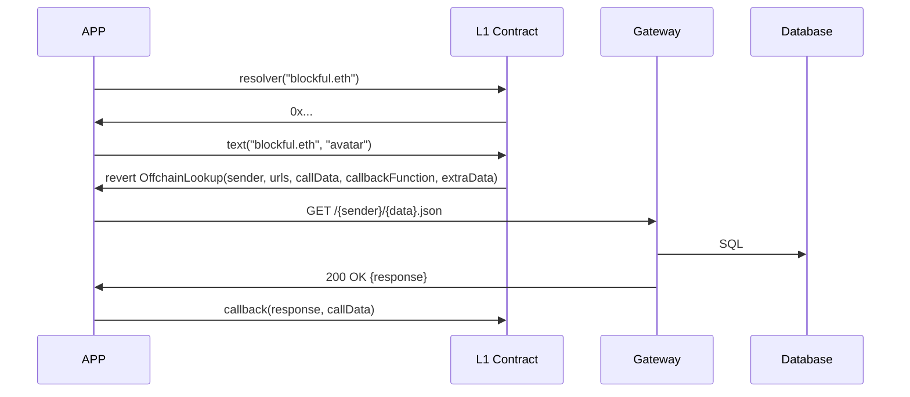
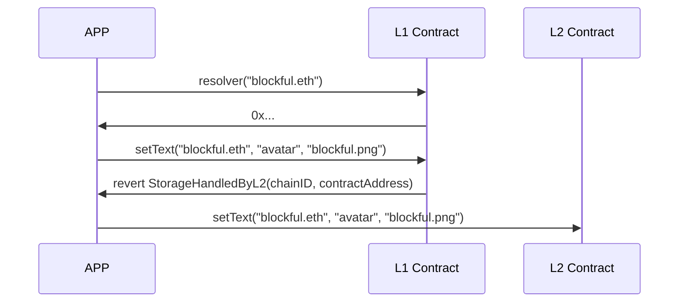

# External Resolver App

## Overview

This repository hosts the frontend application for accessing data from the Ethereum Name Service (ENS) on various layers, including Ethereum, Optimism, or centralized databases. The application provides users with a user-friendly interface to read and write data associated with ENS domains by implementing the [ERC-3668](https://eips.ethereum.org/EIPS/eip-3668) and [EIP-5559](https://eips.ethereum.org/EIPS/eip-5559).

The additional components of this architecture can be found at [Blockful's External Resolver repository](https://github.com/blockful-io/external-resolver-app).

## Architecture

### **Database as data source**



### **L2 as data source**



## Features

- **Flexible Data Access**: Users can access data associated with ENS domains from multiple sources, including Ethereum mainnet, layer 2 solutions, or centralized databases.
  
- **User-Friendly Interface**: The frontend offers an intuitive interface for users to interact with ENS data, making it accessible to both technical and non-technical users.
  
- **Cross-Platform Compatibility**: The application is designed to work seamlessly across various devices and platforms, ensuring accessibility for all users.

## Usage

To use the frontend application, follow these steps:

1. Clone this repository to your local machine.
2. Install dependencies by running:

```bash
yarn install
```

3. Start the development server:

```bash
yarn start
```

4. Access the application through your web browser at `http://localhost:3000`.

## Contributing

We welcome contributions from the community to improve this frontend application. To contribute, please follow these guidelines:

1. Fork the repository and create a new branch for your feature or bug fix.

2. Make your changes and ensure they follow the project's coding conventions.

3. Test your changes locally to ensure they work as expected.

4. Create a pull request with a detailed description of your changes.

## License

This project is licensed under the [MIT License](LICENSE).

## Acknowledgements

Special thanks to the Ethereum Name Service (ENS) community for their contributions and support.
